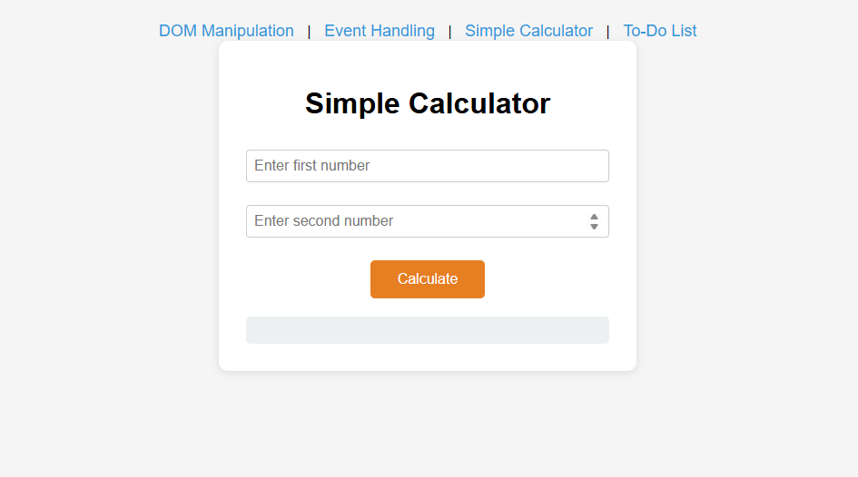
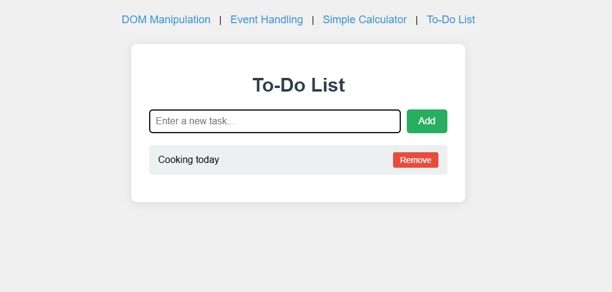

# JavaScript Assignments Workspace

A clean practice workspace for foundational front-end development tasks using **HTML**, **CSS**, and **vanilla JavaScript**.

## Overview

This repository contains multiple assignment pages and shared assets used to practice:

- DOM structure and page composition
- Styling and layout with CSS
- JavaScript interactivity and browser-side logic

## Project Structure

- `index.html` - Main entry page
- `Dom.html` - DOM-focused assignment page
- `part3.html` - Assignment part 3
- `part4.html` - Assignment part 4
- `part5.html` - Assignment part 5
- `styles.css` - Shared styling rules
- `script.js` - Shared JavaScript logic
- `Assignment_Solution.md` - Existing assignment solution notes

## Task 1

## Task 2

## Task3

## Task4

## Task 5

## Enabling GitHub Copilot Code Suggestions

If GitHub Copilot inline suggestions appear disabled in VS Code, follow these steps to re-enable them:

### Quick fix via the status bar
1. Open any file in this project in VS Code.
2. Look at the bottom-right status bar for the **Copilot icon** (it looks like the GitHub logo).
3. Click the icon — if it shows a strikethrough or "Disabled", click it and select **Enable Globally** or **Enable for JavaScript** (and any other language you need).

### Using the Command Palette
1. Press `Ctrl+Shift+P` (Windows/Linux) or `Cmd+Shift+P` (macOS) to open the Command Palette.
2. Type **"Enable GitHub Copilot"** and select the command that appears.

### Via VS Code Settings
1. Open **File → Preferences → Settings** (`Ctrl+,` / `Cmd+,`).
2. Search for **`github.copilot.enable`**.
3. Make sure the toggle is turned **on** for the languages you are using (e.g. `javascript`, `html`, `css`).

### Workspace settings (already configured)
This repository ships with a `.vscode/settings.json` that explicitly enables Copilot for all languages used in the project (`javascript`, `html`, `css`, `markdown`). Opening the folder in VS Code will apply these settings automatically — no manual configuration required.

> **Note:** You must have the [GitHub Copilot extension](https://marketplace.visualstudio.com/items?itemName=GitHub.copilot) installed and be signed in with a GitHub account that has an active Copilot subscription.